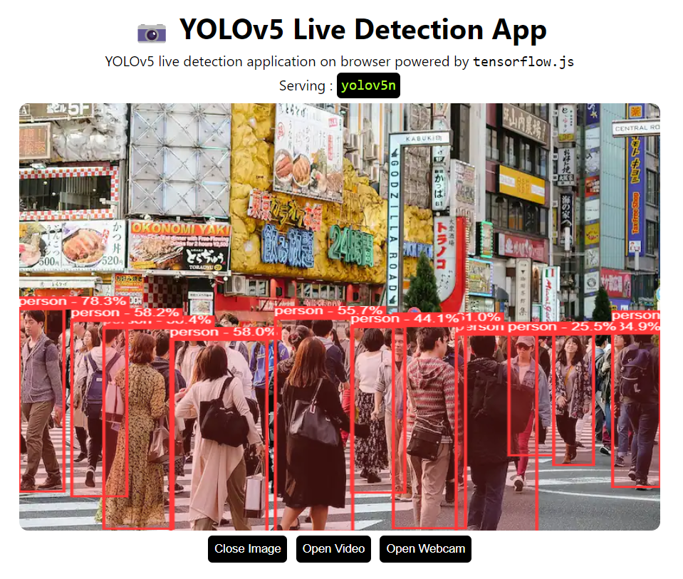

# Object Detection using YOLOv5 and Tensorflow.js

<p align="center">
  
</p>


---

Vue3 version of [yolov5-tfjs](https://github.com/Hyuto/yolov5-tfjs)

---

Object Detection application right in your browser. Serving YOLOv5 in browser using tensorflow.js
with `webgl` backend.

**Setup**

```bash
git clone https://github.com/TheSUNSRise/AnimalIdentification.git
cd AnimalIdentification
npm install #Install dependencies
```

**Scripts**

```bash
npm run dev # Start dev server
npm run build # Build for productions
```

## Model

YOLOv5n model converted to tensorflow.js.

```
used model : yolov5n
size       : 7.5 Mb
```

**Use another model**

Use another YOLOv5 model.

1. Clone [yolov5](https://github.com/ultralytics/yolov5) repository

   ```bash
   git clone https://github.com/ultralytics/yolov5.git && cd yolov5
   ```

   Install `requirements.txt` first

   ```bash
   pip install -r requirements.txt
   ```

2. Export model to tensorflow.js format
   ```bash
   export.py --weights yolov5*.pt --include tfjs
   ```
3. Copy `yolov5*_web_model` to `./public`
4. Update `modelName` in `animalIdentification -> index.vue` to new model name
   ```ts
   ...
   // model configs
   const modelName = "yolov5*"; // change to new model name
   const classThreshold = 0.25;
   ...
   ```
5. Done! 😊

## Reference

https://github.com/Hyuto/yolov5-tfjs
https://github.com/ultralytics/yolov5
